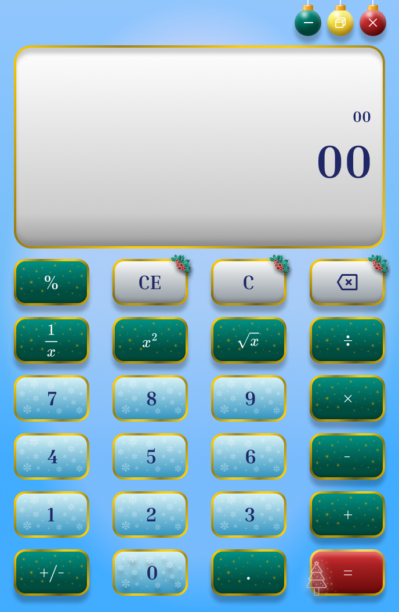
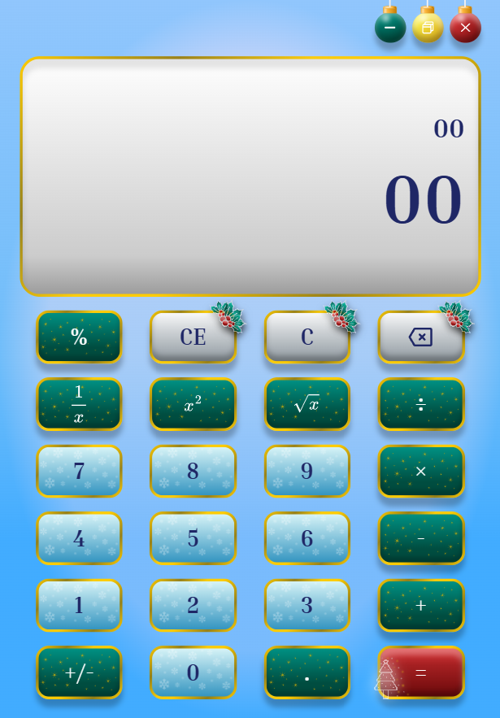

# 🎄 Festive Logic: Christmas Calculator
> A sophisticated, holiday-themed calculator built with a "Design-First" approach. This project demonstrates the bridge between high-fidelity UI/UX design in Figma and responsive web implementation. 

## 📸 Design Preview 

 
<table>
  <!-- First row: Column Headers -->
  <tr>
    <th>UI Mockup (Figma)</th>
    <th>Live Implementation (HTML/CSS)</th>
  </tr>
  <!-- Second row: Comparison Images -->
  <tr>
    <td> 
      
    </td>
    <td>  
      
    </td>
  </tr>
</table>

## 🧱 Design Philosophy 
The core challenge was to create a festive all-ages interface that felt magical for children yet professional and "neutral" for adults. By moving away from literal clipart and focussing on **Micro-Texture** and **Atmospheric Cues**, the UI achievesa premium, jewel-toned aesthetic. 

### 🖌️ Key Design Elements: 
- **Emerald & Gold Operators**: Functional buttons featuring custom "Micro-Texured" sparkles and gold-leaf borders. 
- **Frosted Ice Numbers**: A cool, high-contrast palette with subtle snowflake watermarks to improve readability. 
- **Polished Silver Utility**: A neutral row of chrome-styled buttons with etched holly patterns to balance the vibrant colors. 
- **The Bleeding Technique**: Icons are strategically clipped by button frames to create a dynamic, background-pattern feel rather than a static sticker look. 

## 🖥️ Technical Stack
- **Design**: Figma (Gradients, Inner Shadows, Auto Layout, and Layer Blurring).
- **Frontend**: HTML, CSS, and JavaScript. 

## ✨ Features
- **Sophisticated Shimmer**: Uses variable opacity and layer blurring to mimic physical interaction on emerald and ruby surfaces. 
- **Responsive Grid**: A pixel-perfect layout ensured by Figma's alignment tools. 
- **Functional Precision**: A fully working standard calculator engine wrapped in a luxury holiday skin. 